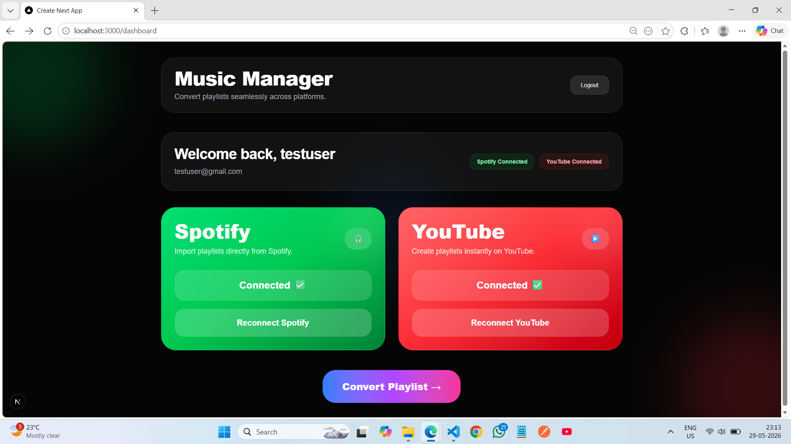
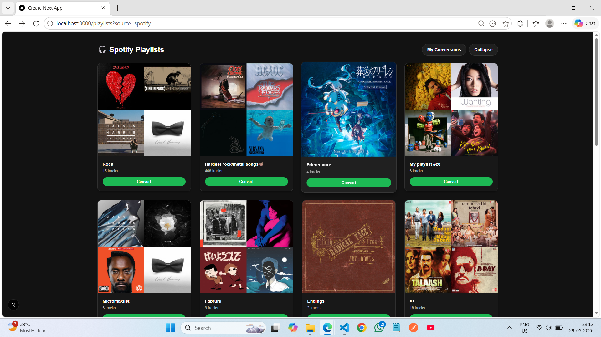
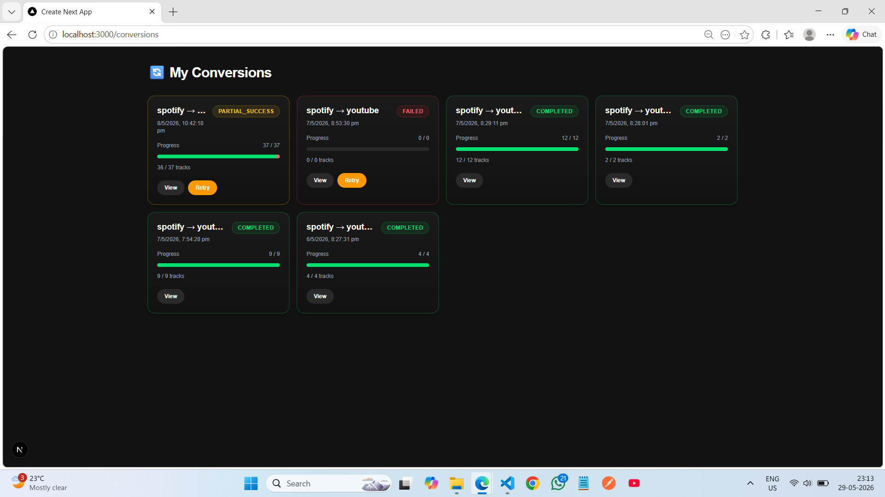
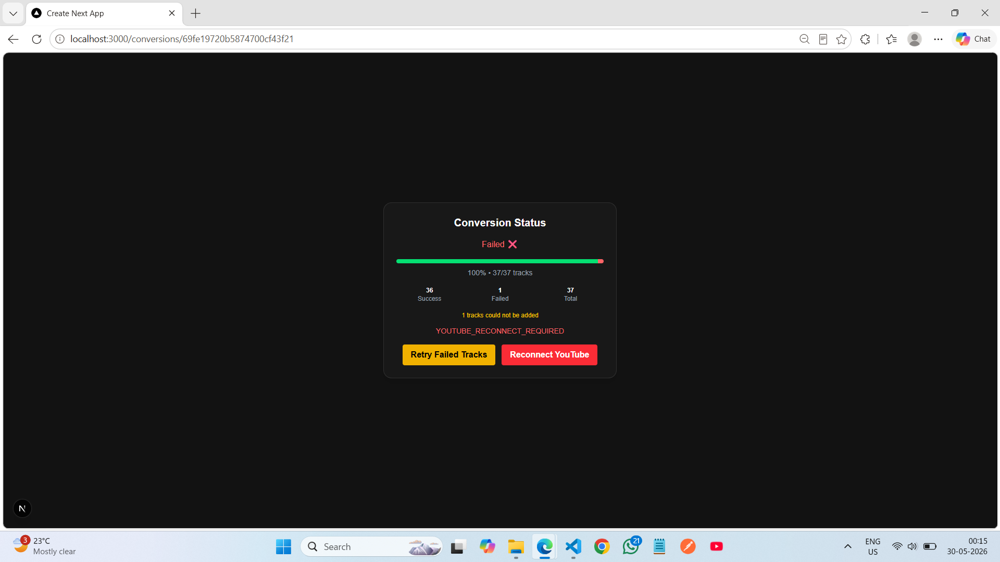

# 🎵 Music Manager SaaS

Production-grade full-stack SaaS application for seamless playlist transfer across music platforms such as **Spotify** and **YouTube Music**.

Built with secure OAuth integrations, asynchronous job processing, retry-safe conversion pipelines, and scalable backend architecture to handle real-world API failures, long-running tasks, and cross-platform music conversion.

---

## 🚀 Live Demo

🌐 **Live Application**
https://music-manager-saas.vercel.app/

---

## ✨ Features

### 🔐 Authentication & Platform Integration

* Secure JWT Authentication
* Spotify OAuth 2.0 Integration
* YouTube OAuth 2.0 Integration
* OAuth Reconnect Flow
* Protected Routes & Session Handling

### 🎼 Playlist Management

* Fetch User Playlists
* Playlist Metadata Normalization
* Spotify → YouTube Playlist Conversion
* Cross-Platform Track Matching

### ⚡ Async Processing & Reliability

* Background Job Processing with **BullMQ + Redis**
* Real-Time Conversion Progress Tracking
* Retry Failed Tracks
* Partial Success Handling
* Exponential Backoff Retry Logic
* Graceful API Failure Recovery

### 🎨 User Experience

* Responsive Modern UI
* Dynamic Progress Tracking
* Conversion Status Monitoring
* Failure Recovery Workflow

---

# 🛠 Tech Stack

## Frontend

* **Next.js**
* **React**
* **Tailwind CSS**
* **Axios**

## Backend

* **Node.js**
* **Express.js**
* **MongoDB**
* **Mongoose**
* **Redis**
* **BullMQ**

## APIs & Integrations

* **Spotify Web API**
* **YouTube Data API**

## Deployment

* **Vercel** → Frontend
* **Render** → Backend

---

# 📸 Screenshots

## Dashboard

Responsive dashboard displaying connected platforms and playlist conversion access.



---

## Playlist Library

Browse playlists fetched directly from Spotify with responsive expanded and collapsed views.



---

## Conversion Progress Tracking

Real-time conversion progress powered by asynchronous BullMQ workers.



---

## Retry Failed Tracks

Selective retry system allowing recovery of failed tracks without rerunning the entire playlist conversion.



---

# 🏗 System Architecture

```text
User
  ↓
Frontend (Next.js)
  ↓
Express API Server
  ↓
BullMQ Queue
  ↓
Redis
  ↓
Worker Process
  ↓
Spotify Playlist Fetch
  ↓
Track Normalization
  ↓
YouTube Track Matching
  ↓
Playlist Creation
  ↓
MongoDB Status Updates
  ↓
Frontend Progress Tracking
```

---

# ⚙️ Engineering Highlights

## OAuth-Based Multi-Platform Integration

Implemented secure OAuth 2.0 authentication flows for both Spotify and YouTube, including:

* Authorization flow
* Token exchange
* Refresh token handling
* Account linking
* OAuth reconnect workflows

This enables secure playlist access without exposing user credentials.

---

## Asynchronous Job Processing

Playlist conversion can take time and may fail due to API limitations.

Instead of blocking API requests, conversion tasks are pushed to **BullMQ queues backed by Redis**, enabling:

* Scalable background processing
* Non-blocking API requests
* Real-time conversion tracking
* Retry-safe execution
* Failure recovery

This mirrors production-style backend architectures used for long-running workloads.

---

## Retry & Recovery Pipeline

Built a resilient recovery system to handle failures caused by:

* API quota exhaustion
* OAuth expiration
* Transient API failures
* Playlist insertion failures

Instead of rerunning entire conversions, users can retry **only failed tracks**, improving reliability and reducing wasted API calls.

---

## Track Normalization System

Implemented a platform-agnostic track normalization pipeline using:

* ISRC metadata mapping
* Artist/title matching
* Album metadata
* Parallel processing with `Promise.all`

to improve cross-platform track matching reliability.

---

## Production-Oriented Backend Design

Designed a modular backend architecture with:

* Controllers
* Middleware
* Workers
* Queues
* Reusable services
* Centralized async error handling
* JWT authentication
* Protected APIs

---

# 🔥 Key Engineering Challenges Solved

### YouTube API Quota Exhaustion

Handled quota failures gracefully without breaking the conversion pipeline.

Implemented retry-safe recovery and partial success handling.

---

### 409 ABORTED Playlist Insertion Errors

Encountered transient YouTube API failures during playlist insertion.

Implemented exponential backoff retry logic to improve reliability.

---

### OAuth Token Expiration & Session Handling

Designed reconnect flows allowing users to securely reconnect accounts without breaking active conversion workflows.

Implemented graceful token invalidation handling for improved user experience.

---

### Queue-Worker Synchronization Issues

Debugged BullMQ queue-worker mismatches that caused jobs to remain unprocessed during development.

---

### Cross-Platform Song Matching

Built normalization logic to improve Spotify → YouTube track matching reliability.

---

# 📂 Project Structure

```text
music-manager/
│
├── assets/
│
├── backend/
│   ├── controllers/
│   ├── middleware/
│   ├── models/
│   ├── queues/
│   ├── routes/
│   ├── workers/
│   └── utils/
│
├── music-manager-frontend/
│   ├── app/
│   ├── components/
│   └── lib/
│
├── .gitignore
└── README.md
```

---

# 🔐 Environment Variables

### Backend `.env`

```env
PORT=5000
NODE_ENV=development

MONGO_URI=your_mongodb_uri

JWT_SECRET_KEY=your_secret
JWT_EXPIRES_IN=7d

SPOTIFY_CLIENT_ID=your_spotify_client_id
SPOTIFY_CLIENT_SECRET=your_spotify_secret
SPOTIFY_REDIRECT_URI=your_spotify_redirect

GOOGLE_CLIENT_ID=your_google_client_id
GOOGLE_CLIENT_SECRET=your_google_secret
GOOGLE_REDIRECT_URI=your_google_redirect

YOUTUBE_API_KEY=your_youtube_api_key

REDIS_URL=your_redis_url

FRONTEND_URL=http://localhost:3000
```

### Frontend `.env.local`

```env
NEXT_PUBLIC_API_URL=http://localhost:5000/api
```

---

# 💻 Local Development Setup

## 1. Clone Repository

```bash
git clone https://github.com/mpgit03/music-manager-saas.git
```

---

## 2. Install Dependencies

### Backend

```bash
cd backend
npm install
```

### Frontend

```bash
cd ../music-manager-frontend
npm install
```

---

## 3. Start Development Servers

### Backend Server

```bash
npm run dev
```

### Worker Process

```bash
npm run worker
```

### Frontend

```bash
cd ../music-manager-frontend
npm run dev
```

---

# 🎯 Future Improvements

* Apple Music Integration
* Playlist Syncing Across Platforms
* WebSocket-Based Real-Time Updates
* AI Playlist Recommendations
* Dockerized Deployment
* CI/CD Pipelines
* Collaborative Playlist Support
* User Analytics Dashboard

---

# 👨‍💻 Author

### Marut Panwar

**GitHub**
https://github.com/mpgit03

**LinkedIn**
https://www.linkedin.com/in/MarutPanwar
